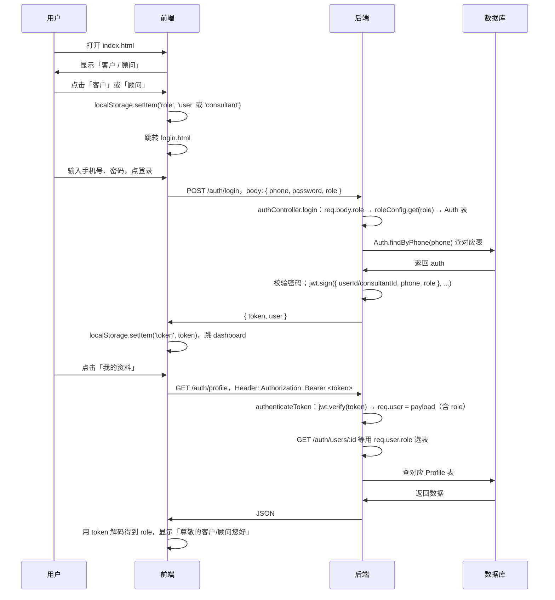

# JWT 里的 role 是什么 + 程序怎么跑

## 一、「在 JWT 中写入 role」/「token 中包含 role」是什么意思？

### 1. JWT 是什么

JWT（JSON Web Token）是一段**字符串**，由三块用 `.` 连起来：

```
头部.载荷.签名
```

- **载荷（payload）**：一段 JSON，用来放「你想带在 token 里的信息」，比如用户 id、手机号、**身份 role**。
- 服务器用**密钥**对「头部+载荷」做签名，得到第三段；验证时用同一密钥校验，没被改过才认为 token 有效。

所以：**「在 JWT 里写入 role」= 在生成 token 时，把 `role` 放进这段 JSON 的载荷里**。  
**「token 中包含 role」= 任何人只要用正确方式解析这段 token（解码 payload），就能从里面读出 `role`**（不改签名的话改 payload 会验签失败）。

### 2. 在我们项目里具体长什么样

**生成 token 时（登录 / 注册设置密码）：**

```javascript
// authController.js 里登录时
const token = jwt.sign(
    { [idKey]: auth.id, phone: auth.phone, role },   // ← 这里把 role 写进「载荷」
    JWT_SECRET,
    { expiresIn: '2h' }
);
```

- 客户登录：`idKey = 'userId'`，载荷里就有 `{ userId: 1, phone: '138...', role: 'user' }`。
- 顾问登录：`idKey = 'consultantId'`，载荷里就有 `{ consultantId: 1, phone: '139...', role: 'consultant' }`。

也就是说：**「在 JWT 中写入 role」= 在 `jwt.sign(..., payload, ...)` 的 payload 对象里加上 `role` 这一项**。

**验证 token 时（需要登录的接口）：**

```javascript
// middleware/auth.js
jwt.verify(token, JWT_SECRET, (err, user) => {
    // 解码成功时，user 就是当初塞进去的 payload
    req.user = user;   // 所以 req.user.role、req.user.userId 等都能用
    next();
});
```

所以：**「token 中包含 role」= 解码后的 payload（我们赋给 `req.user`）里有一项 `role`，后端用 `req.user.role` 就知道当前是客户还是顾问**。

### 3. 小结

| 说法           | 含义 |
|----------------|------|
| 在 JWT 中写入 role | 生成 token 时，在 `jwt.sign()` 的**载荷对象**里加上 `role` 字段。 |
| token 中包含 role  | 这段 token 的**载荷里存了 role**，解码后（如 `req.user`）就能读到 `role`。 |

---

## 二、程序整体是怎么跑的（流程图）

下面用「从打开页面到登录后访问资料」这条主链路说明。

### 2.1 总览（Mermaid 流程图）

```mermaid
flowchart TB
    subgraph 前端
        A[打开网站 / index.html] --> B{选择身份}
        B -->|客户| C[localStorage.role = user]
        B -->|顾问| D[localStorage.role = consultant]
        C --> E[进入 login.html]
        D --> E
        E --> F{操作}
        F -->|登录| G[POST /auth/login 带 body.role]
        F -->|去注册| H[register.html]
        H --> I[check-phone / send-code / verify-code / set-password 都带 body.role]
        I --> J[拿到 token，跳 dashboard]
        G --> K[拿到 token，跳 dashboard]
        J --> L[dashboard / profile 等]
        K --> L
        L --> M[请求头带 Authorization: Bearer token]
        M --> N[后端 middleware 解码 token]
        N --> O[req.user = payload，含 role]
        O --> P[控制器用 req.user.role 选表]
    end

    subgraph 后端
        Q[server.js 挂载 /auth 路由] --> R[authRoutes]
        R --> S[公开接口: check-phone, send-code, verify-code, set-password, login]
        R --> T[需登录: profile, users/:id, change-password]
        T --> N
        S --> U[authController 从 req.body.role 取身份]
        U --> V[roleConfig.get(role) 取 Auth/Profile 模型]
        V --> W[查/写 UserAuth 或 ConsultantAuth]
        P --> V
    end
```

### 2.2 分步说明（按「时间顺序」跑一遍）



### 2.3 关键节点对照代码

| 步骤 | 做什么 | 代码位置 |
|------|--------|----------|
| 选身份 | 前端存 role | `public/index.html`：点客户/顾问 → `localStorage.setItem('role', ...)` |
| 登录带 role | 请求体里带身份 | `public/login.html`：`body: JSON.stringify({ phone, password, role })` |
| 后端按 role 选表 | 用 role 决定查哪张表 | `authController.js`：`role = req.body.role` → `roleConfig.get(role)` → `Auth` / `Profile` |
| 在 JWT 里写入 role | 生成 token 时把 role 放进 payload | `authController.js`：`jwt.sign({ [idKey]: auth.id, phone, role }, ...)` |
| token 中包含 role | 解码后能读到 role | `middleware/auth.js`：`jwt.verify(...)` → `req.user = payload`（含 role） |
| 需登录接口用 role | 不再从 body 读，从 token 读 | `authController.js`：`const role = req.user.role \|\| 'user'` |

### 2.4 数据流简图（role 从哪来到哪去）

```
选身份页：  用户点击 → 前端写入 localStorage.role
                ↓
登录/注册：  前端从 localStorage 取 role → 放在请求 body.role
                ↓
后端：       从 body 取 role → 查/写对应表 → 生成 token 时把 role 写进 payload
                ↓
之后请求：  前端只带 Authorization: Bearer <token>，不再带 body.role
                ↓
后端：       middleware 解码 token → req.user.role → 继续用 roleConfig.get(role) 查对应表
```

这样，**「在 JWT 中写入 role」和「token 中包含 role」** 就都对应到同一件事：**生成 token 时 payload 里带 `role`，之后每次带 token 访问，后端从解码后的 `req.user.role` 拿身份，决定走客户还是顾问逻辑**。整条链路就是上面流程图和表格里描述的那样在跑。
