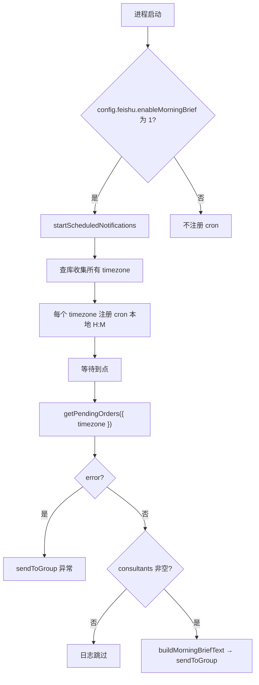

# `scheduledNotifications.js` 运行流程说明

本文说明顾问早间飞书播报模块**怎么被启动、定时器如何工作、到点后依次调用谁**。实现代码见同目录下的 `scheduledNotifications.js`。

---

## 1. 模块在做什么（一句话）

按 **`consultant_profile.timezone`（IANA 时区）** 分组，为**每个出现过的时区**注册一条 **node-cron** 任务：在该时区的**本地指定时刻**（默认每天 08:00，由 **`config.feishu.morningHour` / `morningMinute`** 提供，经 `config/index.js` 从 `.env` 替换）触发；触发后调用 **`orderController.getPendingOrders({ timezone })`**（只统计该时区顾问的待处理订单，并返回该时区顾问列表），再按 **`scripts/test_bot.js`** 同款格式拼一条正文并 **`feishuBot.sendToGroup`** 发飞书（**每个时区每天只发一条**）。

---

## 2. 入口：谁在什么时候调用 `startScheduledNotifications`

| 方式 | 说明 |
|------|------|
| **随 HTTP 服务启动** | 根目录 `server.js` 在 `listen` 回调里：当 **`config.feishu.enableMorningBrief === '1'`**（yaml 中一般为 `${ENABLE_FEISHU_MORNING}`，在 `.env` 里写 `1`）时 `require` 本模块并执行 `startScheduledNotifications()`。 |

未开启早间开关时，主站不会注册任何 cron；飞书 webhook 仍由 `config` / `feishuBot.js` 决定，未配置时 `sendToGroup` 会打日志失败，但若有其他路径调用了播报逻辑，仍可能触发发送尝试。

---

## 3. `startScheduledNotifications` 内部流程（启动阶段）

```
startScheduledNotifications()
    │
    ├─ stopScheduledNotifications()     // 清空并停止已有 job，避免重复注册
    │
    ├─ 读取 config.feishu.morningHour / morningMinute（未替换的 "${VAR}" 视为空，按 8 / 0）→ 拼 cron 表达式「分 时 * * *」
    │
    ├─ ConsultantProfile.findAll({ attributes: ['timezone'] })
    │       → 收集所有出现过的 IANA 时区字符串 → Set<timezone>
    │       → 若库里没有任何顾问行，仍放入默认时区 Asia/Shanghai（到点可能「无顾问跳过」）
    │
    └─ 对 Set 里每个 timezone：
            cron.schedule(cronExpr, 回调, { timezone })
                → node-cron 按「该时区的本地时钟」在每天指定时分触发
                → 每个 job 推入数组 cronJobs
```

要点：

- **一个时区一条 cron**，例如 `America/New_York` 与 `Asia/Shanghai` 各一条，各自在当地可配时分触发，**不是**统一按北京时间。
- **启动时**用 `findAll` 只收集「有哪些时区」；**每次到点**由 `getPendingOrders({ timezone })` 再拉该时区顾问与订单统计（见下节）。

---

## 4. 定时器到点后的流程（运行阶段）

对某个已注册的 `timezone`，cron 回调执行 **`runTimezoneMorningBrief(timezone)`**：

```
runTimezoneMorningBrief(timezone)
    │
    ├─ orderController.getPendingOrders({ timezone })
    │       → 仅该时区（归一化后匹配）的顾问；订单仅 status ∈ pending / accepted / pending_rush
    │       → 成功：{ status, timezone, consultants }；consultants 为该时区全部顾问（id + name）
    │       → 该时区无顾问：{ status: {}, timezone, consultants: [] } → 打日志跳过
    │       → 失败：{ error } → sendToGroup 异常说明后 return
    │
    ├─ consultants.length === 0 → 日志跳过
    │
    └─ buildMorningBriefText(...) → sendToGroup(一条汇总)
```

正文格式与 **`scripts/test_bot.js`** 一致：`👤 ${name}`、总订单、待接单 / 加急待接单 / 已接单待服务（三元式决定是否带数量行风格一致）；无待处理订单的顾问在 `status` 中无条目时，按 **0** 展示。

---

## 5. 配置一览（`.env` → `config.yaml` → `config/index.js`）

| `.env` 变量（示例） | 在 `config.yaml` 中 | 作用 |
|---------------------|---------------------|------|
| `ENABLE_FEISHU_MORNING=1` | `feishu.enableMorningBrief: ${ENABLE_FEISHU_MORNING}` | `server.js` 据此注册 cron。 |
| `FEISHU_MORNING_HOUR` | `feishu.morningHour` | 各时区本地触发小时；未有效设置时本模块默认 `8`。 |
| `FEISHU_MORNING_MINUTE` | `feishu.morningMinute` | 各时区本地触发分钟；未有效设置时默认 `0`。 |

飞书 webhook 为 `feishu.botWebhook`（与 `feishuBot.js`、`scripts/test_bot.js` 一致）。

---

## 6. 导出 API（给其他脚本复用）

| 导出 | 用途 |
|------|------|
| `startScheduledNotifications` | 注册所有时区 cron。 |
| `stopScheduledNotifications` | 停止并清空 `cronJobs`。 |
| `runTimezoneMorningBrief(timezone)` | 手动对某时区跑一遍播报（测试）。 |
| `buildMorningBriefText(...)` | 纯拼接逻辑，便于单测或与 `getPendingOrders` 结果组合。 |

---

## 7. 流程简图（Mermaid）



---

## 8. 运维注意

- **新增从未出现过的 IANA 时区**：需**重启 Node 进程**才会为新时区再注册一条 cron；同一时区内增删顾问**无需重启**，到点会重新走 `getPendingOrders`。
- **进程必须常驻**：cron 在 Node 进程内；未启动服务则不会触发。
- **与订单过期扫描**：`server.js` 里订单过期是另一套 `setInterval`，与本模块互不替代。
