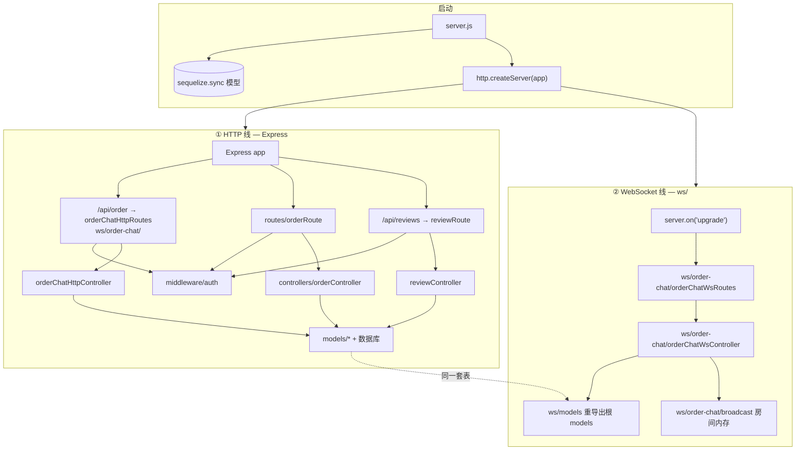
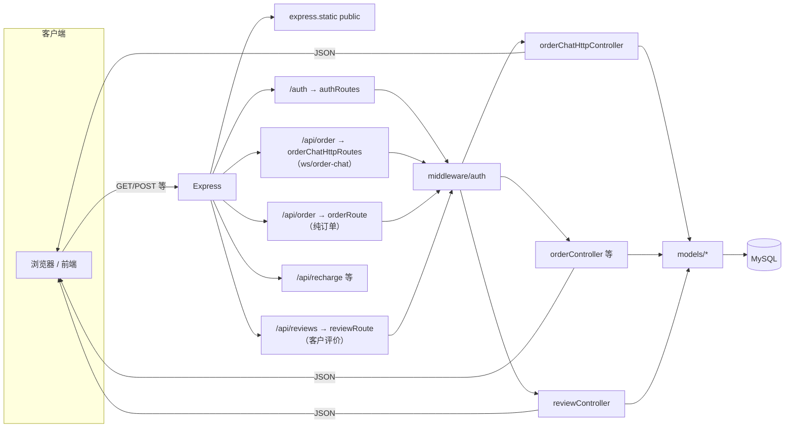
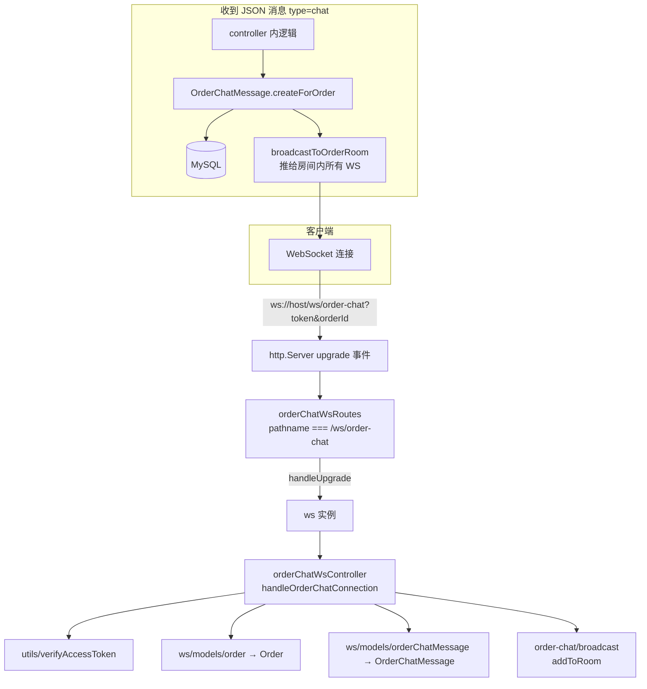
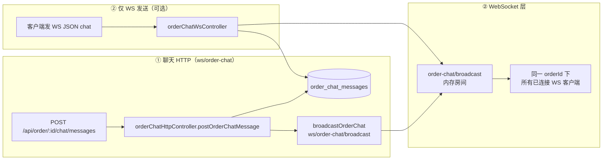

# 代码流程图 — HTTP 与 WebSocket 双线

本文描述 **`server.js` 启动后**，请求进入程序的 **两条并行通道**：

| 线路 | 入口特征 | 主要目录 | 典型用途 |
|------|----------|----------|----------|
| **① HTTP** | `http://`、REST、静态页 | 多数：`routes/` → `controllers/`；**评价** 为 **`reviewRoute` → `reviewController`**；**订单聊天 REST** 在 **`ws/order-chat/orderChatHttp*`** | 登录、纯订单 CRUD、**`/api/reviews` 评价**、聊天 **REST**（会话列表/历史/发送/已读） |
| **② WebSocket** | `Upgrade: websocket`，路径 `/ws/order-chat` | `ws/order-chat/`（routes → controller）+ `ws/models/` 引用表 | 订单聊天 **实时推送**（收消息、`read_receipt` 等） |

两条线共用：**同一端口**、同一 `http.Server`、`utils/verifyAccessToken.js`（JWT）、根目录 **`models/`** 里的表（如 `Order`、`OrderChatMessage`）。

---

## 一、总览：从 `server.js` 分叉

说明：**普通 HTTP 请求**由 Express 处理；**带 WebSocket 升级的请求**在 Node 层被 `upgrade` 截获，**不进入** Express 路由表。

---

## 二、① HTTP 线（纯 REST + 静态资源）

**订单聊天 REST**：实现于 **`ws/order-chat/orderChatHttpController.js`**（`server.js` 里 **`app.use('/api/order', orderChatHttpRoutes)`** 先于 **`orderRoute`**）。路径仍为 **`/api/order/chat/conversations`**、**`/:orderId/chat/messages`** 等；写库后调 **`broadcast.js`** 与 **②** 交汇（见第四节）。

---

## 三、② WebSocket 线（订单聊天室）

要点：

- 鉴权：**query 里的 `token`** + `verifyAccessToken`（与 HTTP Bearer 校验逻辑一致）。
- 业务：订单须 **`in_service`**，且用户/顾问 id 与订单匹配。
- 发消息：可只在 **②** 里发（WS 收 JSON 即落库+广播），也可在 **①** 里 `POST` 发（见下节交汇）。

---

## 四、两线交汇：聊天「HTTP 发送 + WS 收推送」

- **前端 `order-chat.html` 当前策略**：用 **① POST** 发消息（便于展示「发送中/已发送」）；用 **②** 收实时消息与 **`read_receipt`**。
- **`broadcastOrderChat`** 只在 **`ws/order-chat/broadcast.js`** 实现，由 **`ws/index.js`** 导出，**HTTP 的 `orderController`** 与 **WS 的 controller** 共用。

---

## 五、与 JWT 的关系（两条线都用同一套校验思想）

- **HTTP**：`Authorization: Bearer <token>` → `middleware/auth.js` → `verifyAccessToken`。
- **WebSocket**：`?token=<token>` → `orderChatWsController` → 同一 **`verifyAccessToken`**。

更细的 JWT 说明见 **`JWT与程序流程图.md`**；目录与模块说明见 **`代码说明文档.md`**。

---

## 六、如何阅读代码（按线走）

| 想搞懂… | 建议路径 |
|---------|----------|
| 整条 HTTP | `server.js` → `routes/*` → `controllers/*` → `models/*` |
| 整条 WebSocket | `server.js` → `ws/index.js` → `ws/order-chat/orderChatWsRoutes.js` → `orderChatWsController.js` → `broadcast.js` |
| 聊天表与 API | `models/OrderChatMessage.js` + `orderController` 中 `getOrderChatMessages` / `postOrderChatMessage` / `markOrderChatRead` |

---

*文档随当前仓库结构维护（HTTP / WebSocket 双线 + 订单聊天交汇）。*
